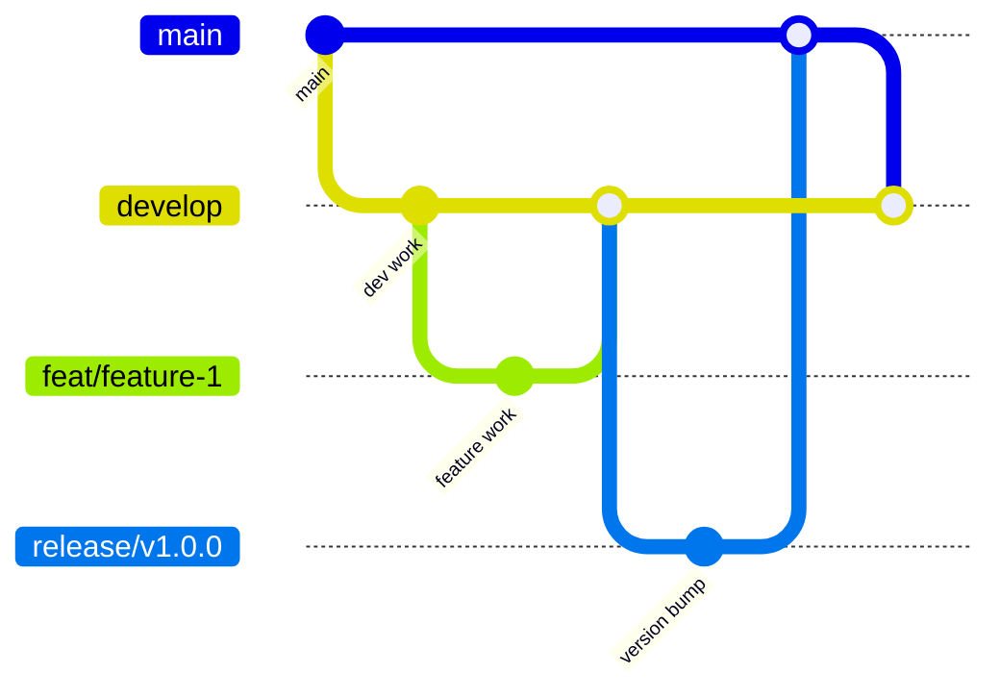
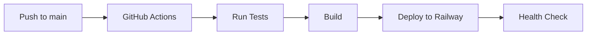

# Git and PR Workflow Guide

This guide consolidates all git workflow, PR rules, and branch management documentation into a single comprehensive resource.

## Table of Contents
1. [Critical Rules - Read First!](#critical-rules---read-first)
2. [Quick Command Reference](#quick-command-reference)
3. [Branch Strategy](#branch-strategy)
4. [Development Workflow](#development-workflow)
5. [PR Creation Rules](#pr-creation-rules)
6. [Branch Protection](#branch-protection)
7. [Syncing Branches](#syncing-branches)
8. [CI/CD and Deployment](#cicd-and-deployment)
9. [Troubleshooting](#troubleshooting)
10. [Tools and Aliases](#tools-and-aliases)

## Critical Rules - Read First!

### 🚨 PR Target Branch Rules

**NEVER create PRs directly to `main`!** The only exceptions:
1. **Release PRs**: From `release/vX.Y.Z` branches after careful preparation
2. **Emergency hotfixes**: With explicit approval and immediate sync
3. **Branch sync**: When syncing `develop` → `main` after releases

**ALWAYS create feature PRs to `develop`!** This includes:
- Features (`feat/*`)
- Fixes (`fix/*`)
- Documentation (`docs/*`)
- Refactoring (`refactor/*`)
- Tests (`test/*`)

### 🔧 Repository Settings

- **Rebase-only workflow**: No merge commits allowed
- **Squash and merge**: Disabled
- **Create a merge commit**: Disabled
- **Allow rebase merging**: Enabled (only option)

### 🚨 Release Merge Strategy

**IMPORTANT**: For release branches merging to main, use **rebase** strategy, NOT squash:

```bash
# When GitHub UI fails with "merge conflicts" (false positive)
git checkout main
git pull origin main
git rebase release/vX.Y.Z
git push origin main
```

**Why rebase for releases?**
- Preserves complete commit history for the release
- Maintains individual feature commit messages
- Avoids losing valuable development context
- Required by our branch protection rules (no merge commits)

## Quick Command Reference

```bash
# Start new feature
git checkout develop
git pull --rebase origin develop
git checkout -b feat/your-feature

# Commit with conventional format
git commit -m "type: description"

# Push and create PR
git push -u origin feat/your-feature
gh pr create --base develop --title "feat: your feature"

# After PR merged, sync develop
git checkout develop
git pull --rebase origin develop

# Sync develop with main (after releases)
git sync-develop  # Custom alias
```

## Branch Strategy



### Branch Types

| Branch | Purpose | Base Branch | Merge Target | Protected |
|--------|---------|-------------|--------------|-----------|
| `main` | Production | - | - | Yes |
| `develop` | Integration | `main` | `main` | Yes |
| `feat/*` | Features | `develop` | `develop` | No |
| `fix/*` | Bug fixes | `develop` | `develop` | No |
| `release/*` | Releases | `develop` | `main` | No |
| `hotfix/*` | Emergency | `main` | `main` + `develop` | No |

## Development Workflow

### 1. Start New Work

```bash
# Always start from updated develop
git checkout develop
git pull --rebase origin develop

# Create feature branch
git checkout -b feat/descriptive-name
```

### 2. Make Changes

Follow conventional commit format:

```bash
# Format: <type>: <description>
git commit -m "feat: add user authentication"
git commit -m "fix: resolve memory leak in webhook handler"
git commit -m "docs: update API documentation"
```

**Commit Types**:
- `feat`: New feature
- `fix`: Bug fix
- `docs`: Documentation only
- `style`: Formatting (no code change)
- `refactor`: Code restructuring
- `test`: Test additions/changes
- `chore`: Maintenance tasks

### 3. Push Changes

```bash
# First push
git push -u origin feat/your-feature

# Subsequent pushes
git push
```

### 4. Create Pull Request

```bash
# Using GitHub CLI (recommended)
gh pr create --base develop --title "feat: your feature description"

# Or use GitHub web interface
# ALWAYS verify base branch is 'develop'!
```

### 5. Code Review Process

1. **Automated checks** run (tests, linting, coverage)
2. **Code review** by team members
3. **Address feedback** with new commits
4. **Approval** from at least one reviewer
5. **Merge** using rebase (automatic via GitHub)

### 6. After Merge

```bash
# Clean up local branch
git checkout develop
git pull --rebase origin develop
git branch -d feat/your-feature

# Delete remote branch (if not auto-deleted)
git push origin --delete feat/your-feature
```

## PR Creation Rules

### GitHub CLI Safety Aliases

Add to your shell configuration:

```bash
# Safe PR creation (always targets develop)
alias pr-feat='gh pr create --base develop'
alias pr-fix='gh pr create --base develop'

# Dangerous PR (requires explicit main target)
alias pr-to-main-danger='echo "⚠️ WARNING: Creating PR to main!" && gh pr create --base main'
```

### PR Title Format

Follow conventional commit format for PR titles:
- `feat: add new personality command`
- `fix: resolve webhook timeout issue`
- `docs: update testing guidelines`

### PR Description Template

```markdown
## Summary
Brief description of changes

## Type of Change
- [ ] Bug fix
- [ ] New feature
- [ ] Breaking change
- [ ] Documentation update

## Testing
- [ ] Tests pass locally
- [ ] New tests added (if applicable)
- [ ] Manual testing completed

## Checklist
- [ ] PR targets `develop` branch
- [ ] Commits follow conventional format
- [ ] Documentation updated
```

## Branch Protection

### Main Branch Protection

- **Restrict push access**: Only admins
- **Require PR reviews**: 1 approval minimum
- **Dismiss stale reviews**: On new commits
- **Require status checks**: All CI must pass
- **Include administrators**: Yes (for emergency)
- **No force pushes**: Ever

### Develop Branch Protection

- **Restrict push access**: Maintainers only
- **Require PR reviews**: For external contributors
- **Status checks required**: All CI must pass
- **Allow direct push**: For maintainers (specific cases only)

### When Direct Push to Develop is Acceptable

1. **Documentation fixes**: Typos, clarifications
2. **Version bumps**: After releases
3. **Emergency fixes**: With team notification
4. **CI/CD fixes**: When PR checks are broken
5. **Dependency updates**: Security patches

**Always prefer PRs** even when direct push is allowed!

## Syncing Branches

### Why Branches Diverge

After merging to `main` (releases, hotfixes), `develop` falls behind. This must be fixed immediately.

### Method 1: Custom Script (Recommended)

```bash
# After any merge to main
git sync-develop

# What it does:
# 1. Checks out main and pulls
# 2. Checks out develop and pulls  
# 3. Rebases develop onto main
# 4. Force pushes develop
```

### Method 2: Manual Sync

```bash
git checkout main
git pull origin main
git checkout develop
git pull origin develop
git rebase main
git push --force-with-lease origin develop
```

### Method 3: GitHub Web UI

1. Create PR: `main` → `develop`
2. Title: "chore: sync develop with main"
3. Merge with **rebase** option

### Automated Sync (Optional)

Add GitHub Action for automatic syncing:

```yaml
name: Sync develop with main
on:
  push:
    branches: [main]

jobs:
  sync:
    runs-on: ubuntu-latest
    steps:
      - uses: actions/checkout@v4
        with:
          fetch-depth: 0
      - name: Sync branches
        run: |
          git checkout develop
          git rebase origin/main
          git push --force-with-lease origin develop
```

## Release Workflow

### Creating a Release

1. **Create Release Branch**
   ```bash
   git checkout develop
   git pull origin develop
   git checkout -b release/vX.Y.Z
   ```

2. **Update Version and Changelog**
   ```bash
   # Edit package.json version
   # Update CHANGELOG.md
   git commit -m "chore: bump version to X.Y.Z and update changelog"
   ```

3. **Create PR to Main**
   ```bash
   gh pr create --base main --title "chore: release vX.Y.Z"
   ```

4. **Handle Merge Issues**
   - If GitHub UI shows false merge conflicts
   - Use command line rebase strategy (see above)
   - Never use squash for releases

5. **Create GitHub Release**
   ```bash
   # After successful merge to main
   git checkout main && git pull origin main
   ./scripts/create-release.sh vX.Y.Z
   ```

6. **Sync Develop**
   ```bash
   git sync-develop
   ```

### Release Branch Protection

- Release branches are NOT protected
- Can be force-pushed during preparation
- Must target main branch for final merge
- Should be deleted after successful release

## CI/CD and Deployment

### GitHub Actions Pipeline

On every PR:
1. **Linting**: ESLint checks
2. **Tests**: Full test suite with coverage
3. **Security**: Dependency vulnerability scan
4. **Build**: Verify production build

### Deployment Flow



### Pre-deployment Checklist

- [ ] All tests passing
- [ ] Coverage maintained/improved
- [ ] No security vulnerabilities
- [ ] Version bumped (if release)
- [ ] CHANGELOG updated
- [ ] PR approved and merged

## Troubleshooting

### Common Issues

#### "Develop is behind main"
```bash
git sync-develop  # Use the sync script
```

#### "Cannot push to protected branch"
- Verify you have correct permissions
- Create PR instead of direct push
- For emergencies, temporarily disable protection

#### "Rebase conflicts"
```bash
# Resolve conflicts file by file
git status  # See conflicted files
# Edit files to resolve
git add <resolved-files>
git rebase --continue
```

#### "Accidentally created PR to main"
1. Close the PR immediately
2. Create new PR targeting develop
3. Use safety aliases to prevent recurrence

### Recovery Procedures

#### Accidental Merge to Wrong Branch
```bash
# If not pushed yet
git reset --hard HEAD~1

# If already pushed (requires force push rights)
git reset --hard <commit-before-merge>
git push --force-with-lease
```

#### Deleted Branch Recovery
```bash
# Find the commit
git reflog
# Recreate branch
git checkout -b branch-name <commit-hash>
```

## Tools and Aliases

### Recommended Git Aliases

Add to `~/.gitconfig`:

```ini
[alias]
    # Workflow aliases
    sync-develop = !sh -c 'git checkout main && git pull && git checkout develop && git pull && git rebase main && git push --force-with-lease origin develop'
    
    # Safety aliases
    pushf = push --force-with-lease
    
    # Utility aliases
    br = branch
    co = checkout
    st = status
    cm = commit -m
    
    # Log aliases
    lg = log --graph --oneline --decorate
    recent = log --oneline -10
```

### Verification Commands

```bash
# Check current branch
git branch --show-current

# Verify PR target (before creating)
gh pr create --preview

# Check branch protection
gh api repos/:owner/:repo/branches/main/protection

# Verify no uncommitted changes
git status --porcelain
```

### Helper Scripts

Located in `/scripts/`:
- `sync-develop.sh` - Sync develop with main
- `create-release.sh` - Automate release process
- `check-branch-status.sh` - Verify branch health

## Summary

### The Golden Rules

1. **Features go to develop** - Never directly to main
2. **Use conventional commits** - Consistent history
3. **Rebase workflow** - No merge commits
4. **Sync after releases** - Keep develop updated
5. **Review before merge** - Quality control
6. **Test locally first** - Don't break CI

### Quick Decision Tree

```
Need to make changes?
├── Feature/Fix/Docs → Create PR to develop
├── Release → Create release branch → PR to main → Sync develop
├── Hotfix → Create hotfix branch → PR to main → Sync develop
└── Sync branches → Use git sync-develop

Creating PR?
├── Normal work → Target: develop
├── Release → Target: main (from release branch)
└── Not sure? → Default to develop!
```

---

Remember: When in doubt, target `develop`. It's always safer to go through the normal flow than to accidentally modify production.