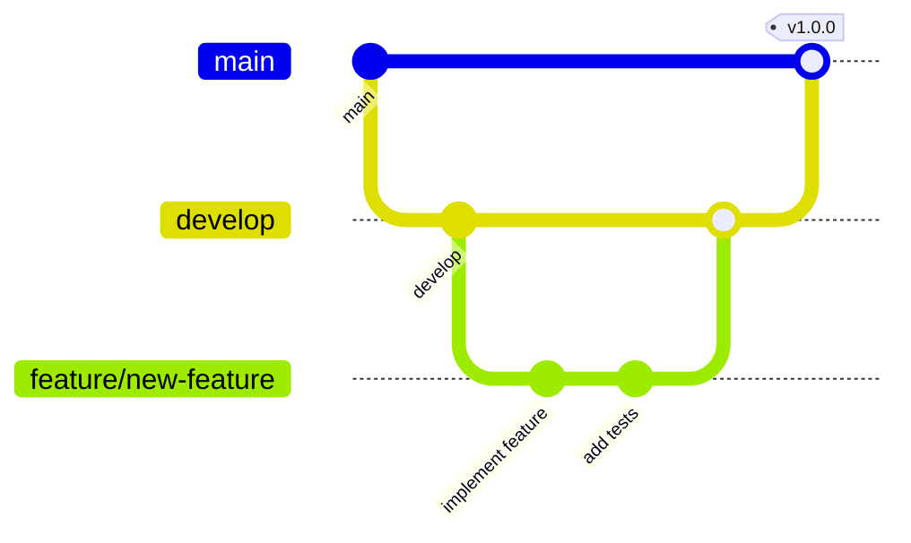

# Git Workflow Guide

This document describes the git workflow for contributing to Tzurot.

## Branch Structure

- **`main`** - Production branch (deployed to Railway production)
- **`develop`** - Development branch (deployed to Railway development environment)
- **`feature/*`** - Feature branches for new functionality
- **`fix/*`** - Branches for bug fixes
- **`chore/*`** - Maintenance and refactoring branches
- **`docs/*`** - Documentation-only changes

## Workflow Overview



## Step-by-Step Workflow

### 1. Starting a New Feature

```bash
# Always start from develop
git checkout develop
git pull origin develop

# Create your feature branch
git checkout -b feature/your-feature-name
```

### 2. Making Changes

```bash
# Make your changes
# ... edit files ...

# Check what you've changed
git status
git diff

# Run tests and linting locally
npm test
npm run lint

# Stage and commit changes
git add .
git commit -m "feat: add new feature

- Detailed description of what was added
- Why it was added
- Any breaking changes"
```

### 3. Pushing Your Branch

```bash
# Push your feature branch
git push -u origin feature/your-feature-name
```

### 4. Creating a Pull Request

1. Go to GitHub
2. Click "Compare & pull request"
3. Set base branch to `develop` (not main!)
4. Fill out the PR template:
   - Clear title
   - Description of changes
   - Testing steps
   - Screenshots if UI changes

### 5. Merging

Since we have branch protection:
- ✅ All CI checks must pass (tests, linting)
- ✅ Branch must be up-to-date with develop
- ✅ No approval required (solo developer mode)

After checks pass, click "Merge pull request"

### 6. Cleanup

```bash
# After PR is merged
git checkout develop
git pull origin develop

# Delete local feature branch
git branch -d feature/your-feature-name

# Delete remote feature branch (optional, GitHub can do this automatically)
git push origin --delete feature/your-feature-name
```

## Commit Message Convention

We follow [Conventional Commits](https://www.conventionalcommits.org/):

```
<type>(<scope>): <subject>

<body>

<footer>
```

### Types
- **feat**: New feature
- **fix**: Bug fix
- **docs**: Documentation only
- **style**: Code style changes (formatting, semicolons, etc)
- **refactor**: Code change that neither fixes a bug nor adds a feature
- **test**: Adding or updating tests
- **chore**: Maintenance tasks, dependency updates

### Examples
```bash
feat: add personality import command
fix: resolve webhook timeout issues
docs: update installation instructions
chore: upgrade discord.js to v14
```

## Syncing Develop to Main

Periodically, when develop is stable:

```bash
# Ensure develop is up to date
git checkout develop
git pull origin develop

# Create a PR from develop to main
# This should be done via GitHub UI for visibility
```

## Branch Protection Rules

Our repository has the following protections:

### For `main` and `develop`:
- ❌ No direct pushes (must use PRs)
- ❌ No force pushes
- ❌ No branch deletion
- ✅ CI checks must pass (tests, linting)
- ✅ Must be up-to-date before merging

### Benefits
- Ensures code quality
- Prevents accidental breaks
- Maintains clean history
- Prepares for team collaboration

## Quick Reference

```bash
# Start feature
git checkout develop && git pull
git checkout -b feature/name

# Work on feature
git add . && git commit -m "feat: description"
git push -u origin feature/name

# After PR merged
git checkout develop && git pull
git branch -d feature/name
```

## CI/CD Pipeline

When you push:
1. **Pre-commit hooks** run locally (if setup)
2. **GitHub Actions** run tests and linting
   - Configured in `.github/workflows/ci.yml`
   - Runs on every PR and push to main/develop
   - Must pass for PRs to be mergeable
3. **Railway** auto-deploys:
   - `develop` → Development environment
   - `main` → Production environment

## Troubleshooting

### "Branch protection prevents push"
You're trying to push directly to develop/main. Create a feature branch instead.

### "Checks failing"
Run `npm test` and `npm run lint` locally to see what's failing.

### "Branch out of date"
```bash
git checkout develop
git pull origin develop
git checkout feature/your-branch
git merge develop
```

## Additional Resources

- [Conventional Commits](https://www.conventionalcommits.org/)
- [GitHub Flow](https://guides.github.com/introduction/flow/)
- [Semantic Versioning](https://semver.org/) (for releases)