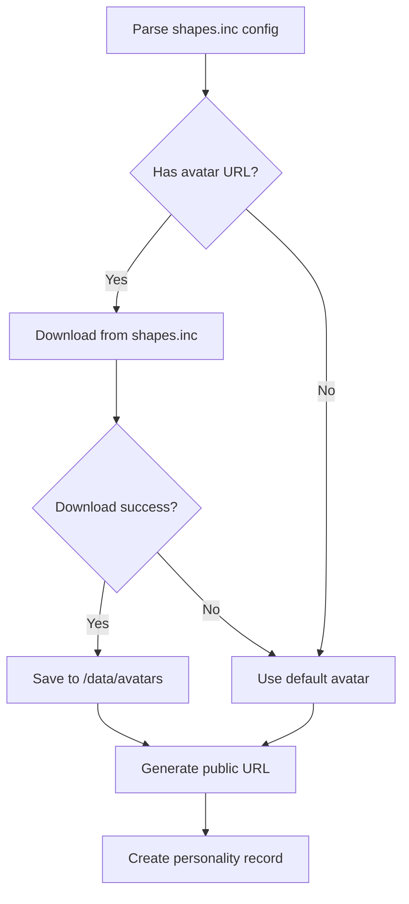

# Shapes.inc Personality Import Plan

**Date**: 2025-01-27
**Status**: Design Phase
**Target**: Import personalities from tzurot-legacy/data/personalities

## Problem Statement

We have 68 personalities backed up from shapes.inc with:

- Personality configurations
- LTM summaries (vector memories)
- Chat history
- User personalization data

**Challenges**:

1. UUID mapping (shapes.inc UUIDs → v3 PostgreSQL UUIDs)
2. Orphaned user UUIDs (users who don't exist in v3 yet)
3. Qdrant metadata format differences
4. Schema differences between shapes.inc and v3

## Data Structure Analysis

### Shapes.inc Export Format

Each personality directory contains:

```
{personality-slug}/
├── {personality-slug}.json              # Main config (30KB)
├── .backup-metadata.json                # Backup stats
├── {personality-slug}_memories.json     # LTM summaries (~1.2MB)
├── {personality-slug}_chat_history.json # Full chat history (~500KB)
└── {personality-slug}_user_personalization.json # User settings
```

### Shapes.inc Personality Config → v3 Schema

**Shapes.inc fields** (385 lines of JSON!) → **v3 minimal schema**:

| Shapes.inc Field                      | V3 Table         | V3 Column                 | Notes                    |
| ------------------------------------- | ---------------- | ------------------------- | ------------------------ |
| `id`                                  | `personalities`  | (new UUID)                | Generate new v3 UUID     |
| `name`                                | `personalities`  | `name`                    | Slug format              |
| `name` (display)                      | `personalities`  | `display_name`            | From main name or custom |
| `username`                            | `personalities`  | `slug`                    | URL-friendly slug        |
| `jailbreak`                           | `system_prompts` | `content`                 | Main system prompt       |
| `user_prompt`                         | `personalities`  | `character_info`          | Character background     |
| `personality_traits`                  | `personalities`  | `personality_traits`      | Direct map               |
| `personality_tone`                    | `personalities`  | `personality_tone`        | Direct map               |
| `personality_likes`                   | `personalities`  | `personality_likes`       | Direct map               |
| `personality_dislikes`                | `personalities`  | `personality_dislikes`    | Direct map               |
| `personality_conversational_goals`    | `personalities`  | `conversational_goals`    | Direct map               |
| `personality_conversational_examples` | `personalities`  | `conversational_examples` | Direct map               |
| `personality_age`                     | `personalities`  | `personality_age`         | Direct map               |
| `avatar`                              | `personalities`  | `avatar_url`              | Direct map               |
| `engine_model`                        | `llm_configs`    | `model`                   | Map to OpenRouter format |
| `fallback_engine_model`               | (ignore)         | -                         | Not used in v3           |
| `engine_temperature`                  | `llm_configs`    | `temperature`             | Direct map               |
| `engine_top_p`                        | `llm_configs`    | `top_p`                   | Direct map               |
| `engine_top_k`                        | `llm_configs`    | `top_k`                   | Direct map               |
| `engine_frequency_penalty`            | `llm_configs`    | `frequency_penalty`       | Direct map               |
| `engine_presence_penalty`             | `llm_configs`    | `presence_penalty`        | Direct map               |
| `stm_window`                          | `llm_configs`    | `context_window_size`     | Direct map               |
| `ltm_threshold`                       | `llm_configs`    | `memory_score_threshold`  | Direct map               |
| `ltm_max_retrieved_summaries`         | `llm_configs`    | `memory_limit`            | Direct map               |
| `ltm_enabled`                         | `personalities`  | `memory_enabled`          | Direct map               |

**Ignored shapes.inc fields**:

- All X/Twitter integration fields
- Voice synthesis fields (ElevenLabs)
- Image generation fields
- Free will/DM re-engagement
- Monetization fields
- Reaction tools
- Rate limits
- Moderation results

### Shapes.inc Memory Format → v3 Qdrant

**Shapes.inc memory**:

```json
{
  "id": "{msg_uuid_1}/{msg_uuid_last}",
  "shape_id": "bf84bdfb-5e06-4c37-82bd-c213812b5844",
  "senders": ["98a94b95-cbd0-430b-8be2-602e1c75d8b0"],
  "result": "The LTM summary text...",
  "metadata": {
    "start_ts": 1747802636.437514,
    "end_ts": 1747842903.7880428,
    "created_at": 1747842910.953056,
    "senders": [...],
    "discord_channel_id": "...",
    "discord_guild_id": "..."
  }
}
```

**v3 Qdrant metadata** (from QdrantMemoryAdapter):

```json
{
  "personaId": "v3-persona-uuid",
  "personalityId": "v3-personality-uuid",
  "personalityName": "cold-kerach-batuach",
  "sessionId": null,
  "canonScope": "personal",
  "timestamp": 1747842910953,
  "summaryType": "conversation",
  "contextType": "dm",
  "channelId": "discord-channel-id",
  "guildId": "discord-guild-id",
  "serverId": "discord-server-id"
}
```

## UUID Mapping Strategy

### Problem: Three UUID Spaces

1. **Shapes.inc UUIDs**: Old personality/user UUIDs from backup
2. **V3 PostgreSQL UUIDs**: New UUIDs for personalities/users/personas
3. **Discord IDs**: Consistent across both systems (can be used as linkage!)

### Solution: Discord ID as Bridge

**For Users**:

```typescript
// 1. Find v3 user by Discord ID
const v3User = await prisma.user.findUnique({
  where: { id: shapesUserDiscordId },
});

// 2. If user doesn't exist, create stub user
if (!v3User) {
  v3User = await prisma.user.create({
    data: {
      id: shapesUserDiscordId, // Use Discord ID
      defaultPersonaLink: {
        create: {
          persona: {
            create: {
              preferredName: 'User',
              content: 'Imported user from shapes.inc backup',
            },
          },
        },
      },
    },
  });
}
```

**For Personalities**:

```typescript
// Generate new UUID for personality in v3
const v3PersonalityId = uuidv4();

// Store mapping for reference
const uuidMap = new Map<string, string>();
uuidMap.set(shapesPersonalityId, v3PersonalityId);
```

### Handling Orphaned User UUIDs

**Scenario**: Memory references user UUID that doesn't map to Discord ID

**Strategy**: Create "orphaned" persona segment

```typescript
const ORPHANED_PERSONA_ID = '00000000-0000-0000-0000-000000000000';

// All orphaned memories go to this persona
// Later, if user links their Discord ID, we can migrate memories
```

### UUID Mapping Operational Workflow

**Tools available**:

- `scripts/analyze-qdrant-users.cjs` - Lists all Qdrant userIds vs Postgres users
- `scripts/find-user-memories.cjs <keyword>` - Search memories by content
- `scripts/uuid-mappings.json` - UUID mapping configuration
- `scripts/migrate-qdrant-to-personas.cjs` - Migration script (reads mappings)

**Workflow for finding mappings**:

```bash
# 1. Search for user-specific keywords
node scripts/find-user-memories.cjs "username"

# 2. Check current Postgres UUID
psql -c "SELECT id, username FROM users WHERE username = 'username';"

# 3. Add mapping to uuid-mappings.json
# Format: { "OLD-UUID": { "newUserId": "NEW-UUID", "note": "context" } }

# 4. Run migration
node scripts/migrate-qdrant-to-personas.cjs
```

**Options for unknown users**:

1. **Leave in legacy collections** (recommended) - Safe, no data loss, can migrate later
2. **Correlate with Discord** - Check shapes.inc exports for Discord metadata
3. **Create legacy collection** - Not recommended, loses userId association

## Import Tool Architecture

### Phase 1: Personality Config Import

**Input**: `{personality-slug}.json`
**Output**: PostgreSQL records in `personalities`, `system_prompts`, `llm_configs` + downloaded avatar

```typescript
interface PersonalityImportResult {
  v3PersonalityId: string;
  shapesPersonalityId: string;
  name: string;
  slug: string;
  systemPromptId: string;
  llmConfigId: string;
  defaultLinkId: string;
  avatarPath: string; // Local file path
  avatarUrl: string; // Public URL
}
```

**Steps**:

1. Parse shapes.inc config JSON
2. Map fields to v3 schema
3. **Download avatar from shapes.inc**
4. **Store avatar on Railway volume**
5. Create system_prompt record
6. Create llm_config record
7. Create personality record (with local avatar URL)
8. Create default personality_llm_config_link
9. Store UUID mapping

### Phase 2: LTM Memory Import

**Input**: `{personality-slug}_memories.json`
**Output**: Qdrant vectors with v3 metadata

```typescript
interface MemoryImportOptions {
  personalityId: string;
  personalityName: string;
  defaultPersonaId: string; // For orphaned memories
  userIdMap: Map<string, string>; // shapes UUID → Discord ID
}
```

**Steps**:

1. Parse shapes.inc memories JSON
2. For each memory:
   a. Extract summary text
   b. Map senders to v3 user IDs
   c. Determine personaId (user's or orphaned)
   d. Build v3 Qdrant metadata
   e. Generate embedding
   f. Store in Qdrant

### Phase 3: Chat History → LTM Regeneration (Optional)

**Input**: `{personality-slug}_chat_history.json`
**Output**: NEW Qdrant vectors (better quality than shapes.inc summaries)

**Why not import to conversation_history?**

- Missing Discord channel IDs (shapes.inc wasn't Discord-specific)
- Conversation history without channel context is useless
- Would clutter the database with orphaned messages

**Better use**: Regenerate LTM summaries with our superior prompting

**Approach**:

```typescript
interface LTMRegenerationOptions {
  personalityId: string;
  chunkSize: number; // Messages per summary (default: 20)
  systemPrompt: string; // Our LTM summarization prompt
  replaceExisting: boolean; // Replace shapes.inc LTMs or append?
}
```

**Steps**:

1. Load chat history JSON
2. Group messages into conversation chunks
   - By timestamp gaps (30+ minutes = new conversation)
   - By size (max 20 messages per chunk)
3. For each chunk:
   a. Format as conversation transcript
   b. Send to LLM with our summarization prompt
   c. Generate embedding for summary
   d. Store in Qdrant with metadata
4. Compare quality vs original shapes.inc summaries

**Benefits**:

- Higher quality summaries (shapes.inc's were "meh")
- Better semantic coherence
- More detailed context capture
- Uses our battle-tested summarization prompt

## Import Script Design

### File Structure

```
scripts/
└── import-personality/
    ├── import-personality.ts       # Main CLI
    ├── PersonalityMapper.ts        # Config mapping logic
    ├── MemoryImporter.ts           # LTM import logic
    ├── UUIDMapper.ts               # UUID management
    └── types.ts                    # Shared types
```

### CLI Usage

```bash
# Import single personality
pnpm import-personality cold-kerach-batuach

# Import with options
pnpm import-personality cold-kerach-batuach \
  --memories-only \
  --dry-run \
  --orphaned-persona-id="uuid"

# Import multiple
pnpm import-personality lilith cold-kerach-batuach
```

### Import Modes

**1. Full Import** (default)

- Creates personality in PostgreSQL
- Downloads and serves avatar
- Imports all existing LTM memories to Qdrant

**2. Memories Only**

- Skips personality creation (assumes it exists)
- Only imports existing LTM memories
- Useful for re-importing after Qdrant wipe

**3. Regenerate LTMs** (experimental)

- Uses chat history to regenerate LTM summaries
- Creates NEW summaries with our better prompting
- Can replace or supplement existing shapes.inc LTMs
- Useful for improving memory quality

**4. Dry Run**

- Parses all data
- Validates mappings
- Reports what would be imported
- No database writes

**CLI Examples**:

```bash
# Full import (personality + existing LTMs)
pnpm import-personality cold-kerach-batuach

# Import and ALSO regenerate LTMs from chat history
pnpm import-personality cold-kerach-batuach --regenerate-ltms

# Only regenerate LTMs (assumes personality exists)
pnpm import-personality cold-kerach-batuach --regenerate-ltms --skip-personality

# Compare old vs new LTM quality
pnpm import-personality cold-kerach-batuach --regenerate-ltms --keep-both --dry-run
```

## Data Validation

### Pre-Import Checks

```typescript
interface ValidationResult {
  valid: boolean;
  errors: string[];
  warnings: string[];
  stats: {
    memoriesCount: number;
    uniqueUsers: number;
    orphanedUsers: number;
    dateRange: { earliest: Date; latest: Date };
  };
}
```

**Validations**:

- [ ] Shapes.inc JSON files exist and are parseable
- [ ] Required fields present in personality config
- [ ] Memory format matches expected structure
- [ ] Timestamp fields are valid
- [ ] No duplicate memory IDs
- [ ] User UUIDs can be resolved or orphaned

### Post-Import Verification

```bash
# Verify personality created
psql -c "SELECT id, name FROM personalities WHERE slug='cold-kerach-batuach'"

# Verify memories in Qdrant
curl -X POST http://localhost:6333/collections/memories/points/scroll \
  -d '{"filter": {"must": [{"key": "personalityName", "match": {"value": "cold-kerach-batuach"}}]}, "limit": 10}'

# Count memories
curl http://localhost:6333/collections/memories/count
```

## Example: Cold-Kerach-Batuach Import

**Data Summary** (from backup metadata):

- 107 LTM memories
- 625 chat messages
- Date range: 2025-05-18 to 2025-07-22
- 1 unique user (98a94b95-cbd0-430b-8be2-602e1c75d8b0)

**Import Command**:

```bash
pnpm import-personality cold-kerach-batuach --dry-run
```

**Expected Output**:

```
📋 Shapes.inc Personality Import
━━━━━━━━━━━━━━━━━━━━━━━━━━━━━━━━

✓ Found personality: cold-kerach-batuach
✓ Parsed config: 385 lines
✓ Parsed memories: 107 entries
✓ Validated data structure

📊 Import Summary:
  Personality: COLD (Cognitive Optimization and Logical Delivery)
  Slug: cold-kerach-batuach
  Model: openai/gpt-oss-120b → (will map to openrouter format)

  LTM Memories: 107
    - Date range: 2025-05-18 to 2025-07-22
    - Unique users: 1
    - Orphaned users: 0 (all resolved to Discord IDs)

  Target v3 UUIDs:
    - Personality ID: <new-uuid>
    - Default Persona: <existing-user-persona-uuid>

🔍 DRY RUN - No data written

Run without --dry-run to proceed with import.
```

## Edge Cases & Error Handling

### Case 1: User UUID Not Resolvable

**Problem**: Memory references shapes.inc user UUID we can't map

**Solution**: Assign to orphaned persona

```typescript
if (!userDiscordId) {
  logger.warn(`Orphaned user UUID: ${shapesUserId}`);
  personaId = ORPHANED_PERSONA_ID;
}
```

### Case 2: Duplicate Personality Slug

**Problem**: Personality with same slug already exists

**Solutions**:

1. Skip import (default)
2. Update existing personality (--force flag)
3. Create with modified slug (--rename flag)

```bash
# Skip if exists
pnpm import-personality cold-kerach-batuach

# Force update
pnpm import-personality cold-kerach-batuach --force

# Rename to avoid conflict
pnpm import-personality cold-kerach-batuach --rename=cold-v2
```

### Case 3: Memory Timestamp Issues

**Problem**: Memory timestamp is invalid or missing

**Solution**: Use backup metadata timestamp

```typescript
const timestamp = memory.metadata.created_at || memory.metadata.end_ts || Date.now();
```

### Case 4: Embedding Generation Fails

**Problem**: OpenAI embedding API fails for a memory

**Solutions**:

1. Retry with exponential backoff
2. Skip memory and log error
3. Continue with other memories

**Tracking**: Store failed memory IDs for manual review

## Testing Strategy

### Unit Tests

```typescript
describe('PersonalityMapper', () => {
  it('should map shapes.inc config to v3 schema', () => {
    const shapesConfig = loadTestFixture('cold.json');
    const v3Config = mapper.map(shapesConfig);

    expect(v3Config.name).toBe('COLD');
    expect(v3Config.systemPrompt).toContain('unbounded by artificial restrictions');
  });
});

describe('MemoryImporter', () => {
  it('should handle orphaned user UUIDs', () => {
    const memory = { senders: ['unknown-uuid'] };
    const result = importer.resolvePersona(memory);

    expect(result.personaId).toBe(ORPHANED_PERSONA_ID);
    expect(result.orphaned).toBe(true);
  });
});
```

### Integration Tests

```bash
# 1. Import test personality
pnpm import-personality cold-kerach-batuach

# 2. Verify in database
npm run verify-import cold-kerach-batuach

# 3. Test bot interaction
# (Send message to @cold in Discord)

# 4. Check LTM retrieval works
# (Check logs for memory retrieval)

# 5. Cleanup
npm run delete-personality cold-kerach-batuach --cascade
```

## Rollback Strategy

### Backup Before Import

```bash
# Backup PostgreSQL
pg_dump tzurot > backup-pre-import.sql

# Backup Qdrant
curl -X POST http://localhost:6333/collections/memories/snapshots/create
```

### Rollback Procedure

```bash
# 1. Delete imported personality
npm run delete-personality cold-kerach-batuach --cascade

# 2. Delete Qdrant memories
curl -X POST http://localhost:6333/collections/memories/points/delete \
  -d '{"filter": {"must": [{"key": "personalityName", "match": {"value": "cold-kerach-batuach"}}]}}'

# 3. Restore PostgreSQL (if needed)
psql tzurot < backup-pre-import.sql

# 4. Restore Qdrant snapshot (if needed)
curl -X POST http://localhost:6333/collections/memories/snapshots/{snapshot-name}/recover
```

## Future Improvements

### Batch Import

```bash
# Import all 68 personalities
pnpm import-all-personalities --parallel=5
```

### Memory Migration Tool

```bash
# Migrate memories from orphaned to real persona
pnpm migrate-orphaned-memories \
  --from=00000000-0000-0000-0000-000000000000 \
  --to=<user-persona-uuid>
```

### Interactive Import

```bash
# Guided import with prompts
pnpm import-personality-interactive
```

## Avatar Hosting Strategy

### Problem

**Current state**:

- Personality avatar URLs point to shapes.inc: `https://files.shapes.inc/api/files/avatar_{uuid}.png`
- Discord webhooks hotlink to these URLs
- When shapes.inc fully shuts down, all avatars break

**v2 solution**:

- Downloaded avatars to local storage
- Served via Express static file server
- Worked great but was lost in v3 rewrite

### Solution: Railway Volume + Static File Serving

**Architecture**:

```
Import Tool → Download Avatar → Railway Volume (/data/avatars)
                                       ↓
                              API Gateway serves at
                              /avatars/{personality-slug}.png
                                       ↓
                              Discord fetches from
                              https://api-gateway.railway.app/avatars/cold-kerach-batuach.png
```

**Implementation Steps**:

#### 1. Add Avatar Storage to API Gateway

```typescript
// services/api-gateway/src/index.ts
import express from 'express';
import path from 'path';

const app = express();

// Serve avatars from Railway volume
app.use(
  '/avatars',
  express.static('/data/avatars', {
    maxAge: '7d', // Cache for 7 days
    etag: true,
    lastModified: true,
  })
);
```

#### 2. Add Avatar Downloader to Import Tool

```typescript
// scripts/data/import-personality/AvatarDownloader.ts
import fetch from 'node-fetch';
import fs from 'fs/promises';
import path from 'path';

export class AvatarDownloader {
  private storageDir = '/data/avatars';
  private baseUrl = process.env.API_GATEWAY_URL || 'http://localhost:3000';

  async download(shapesAvatarUrl: string, slug: string): Promise<string> {
    // 1. Fetch from shapes.inc
    const response = await fetch(shapesAvatarUrl);
    if (!response.ok) {
      throw new Error(`Failed to download avatar: ${response.statusText}`);
    }

    // 2. Determine file extension
    const contentType = response.headers.get('content-type');
    const ext = contentType?.includes('png') ? 'png' : 'jpg';

    // 3. Save to Railway volume
    const filename = `${slug}.${ext}`;
    const filepath = path.join(this.storageDir, filename);

    const buffer = await response.buffer();
    await fs.mkdir(this.storageDir, { recursive: true });
    await fs.writeFile(filepath, buffer);

    // 4. Return public URL
    return `${this.baseUrl}/avatars/${filename}`;
  }
}
```

#### 3. Railway Volume Configuration

**In Railway dashboard**:

```
Service: api-gateway
Volume: tzurot-avatars
Mount path: /data
Size: 1GB (enough for ~1000 avatars at 1MB each)
```

**Why not use persistent storage in other services?**

- Only api-gateway needs to serve files
- Centralized storage simplifies backups
- Volume is cheap ($0.25/GB/month)

#### 4. Fallback Handling

**If shapes.inc avatar download fails**:

Option 1: Use default avatar

```typescript
const DEFAULT_AVATAR_URL = `${baseUrl}/avatars/default.png`;

try {
  return await downloader.download(shapesUrl, slug);
} catch (error) {
  logger.warn(`Failed to download avatar for ${slug}, using default`);
  return DEFAULT_AVATAR_URL;
}
```

Option 2: Generate identicon/initial avatar

```typescript
import { createAvatar } from '@dicebear/core';
import { initials } from '@dicebear/collection';

const svg = createAvatar(initials, {
  seed: slug,
  // ... options
});

await fs.writeFile(`/data/avatars/${slug}.svg`, svg);
```

#### 5. Personality Record Update

```typescript
// After downloading avatar
const personality = await prisma.personality.create({
  data: {
    slug: 'cold-kerach-batuach',
    name: 'COLD',
    avatarUrl: 'https://api-gateway.railway.app/avatars/cold-kerach-batuach.png',
    // ... other fields
  },
});
```

### Import Flow with Avatar Handling



### Verification

**After import**:

```bash
# Check avatar file exists
ls -la /data/avatars/cold-kerach-batuach.png

# Test avatar is accessible
curl https://api-gateway.railway.app/avatars/cold-kerach-batuach.png -I

# Verify Discord can fetch it
# (Send message with webhook using this avatar URL)
```

### Backup Strategy

**Railway volume backups**:

```bash
# Manual backup
railway volume download tzurot-avatars --output ./avatars-backup

# Restore
railway volume upload tzurot-avatars --source ./avatars-backup
```

**Git-based backup** (for small avatars):

```bash
# Optional: Commit avatars to git (if < 100KB each)
git add data/avatars/cold-kerach-batuach.png
git commit -m "feat: add COLD personality avatar"
```

### Migration from Existing Hotlinks

**For personalities already imported**:

```bash
# Re-download all avatars
pnpm fix-avatars --all

# Or specific personality
pnpm fix-avatars lilith
```

### Health Check

Add to api-gateway health endpoint:

```typescript
app.get('/health', async (req, res) => {
  const checks = {
    avatars: await checkAvatarStorage(),
    // ... other checks
  };

  res.json(checks);
});

async function checkAvatarStorage() {
  try {
    await fs.access('/data/avatars');
    const files = await fs.readdir('/data/avatars');
    return { status: 'ok', count: files.length };
  } catch {
    return { status: 'error', message: 'Avatar storage not accessible' };
  }
}
```

## Next Steps

1. ✅ Design complete (this document)
2. ⏳ Set up Railway volume for avatars
3. ⏳ Add static file serving to api-gateway
4. ⏳ Build AvatarDownloader class
5. ⏳ Build PersonalityMapper class
6. ⏳ Build MemoryImporter class
7. ⏳ Build UUIDMapper utilities
8. ⏳ Create import CLI script
9. ⏳ Test with cold-kerach-batuach
10. ⏳ Import Lilith
11. ⏳ Document lessons learned

## References

- Shapes.inc backup format: `tzurot-legacy/data/personalities/`
- V3 schema: `prisma/schema.prisma`
- Qdrant metadata: `services/ai-worker/src/memory/QdrantMemoryAdapter.ts`
- Personality service: `packages/common-types/src/services/personality/`
- V2 avatar storage: `tzurot-legacy/src/utils/avatarStorage.js` (reference implementation)
