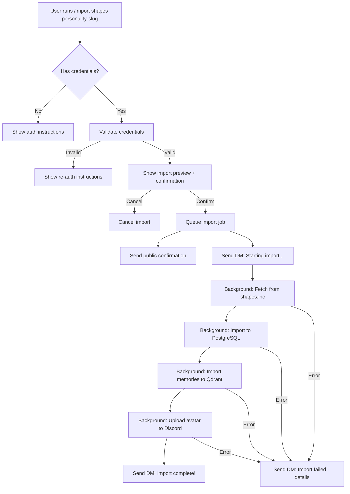
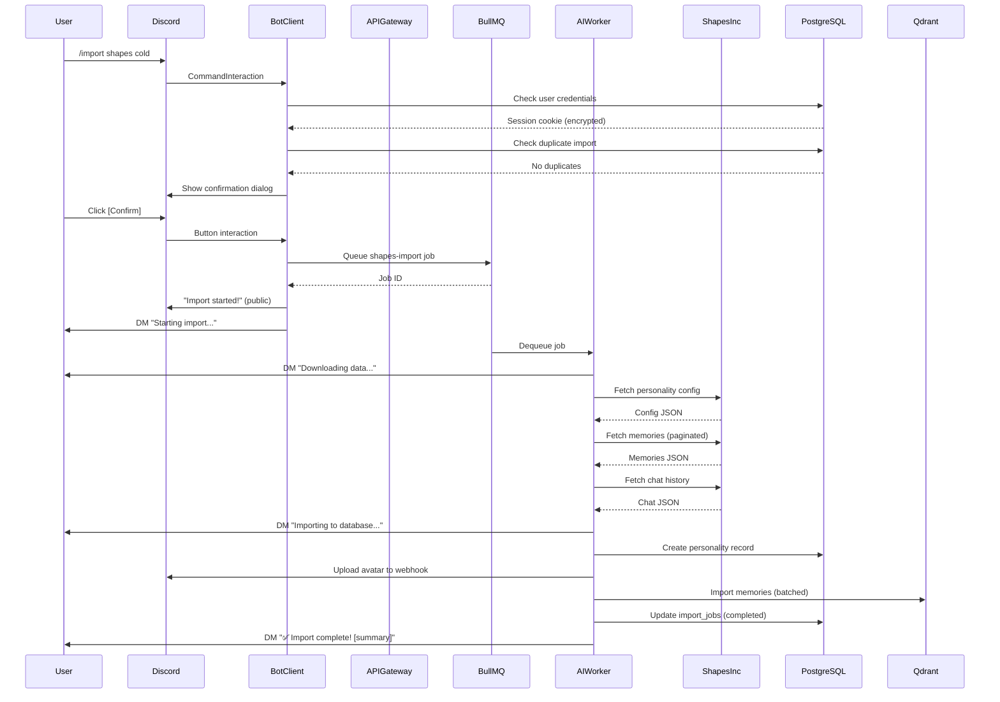

# Shapes.inc Import Slash Command Design

> **Created**: 2025-11-17
> **Status**: Superseded by [`docs/proposals/active/shapes-inc-import-plan.md`](../active/shapes-inc-import-plan.md)
> **Purpose**: Detailed reference for shapes.inc import design (UX flows, security, error handling)
>
> **Technical Reference**: See [SHAPES_INC_MIGRATION_REFERENCE.md](../migration/SHAPES_INC_MIGRATION_REFERENCE.md) for data structures, UUID mapping, LTM handling strategy, and scripts reference.
>
> **Key Reference Code**:
>
> - V2 Backup Script: `tzurot-legacy/scripts/backup-personalities-data.js`
> - V3 Import Scripts: `scripts/data/import-personality/`
>
> **Note**: Shapes.inc killed their public bot API, but internal APIs still work with user session cookies. This enables data exfiltration for users who want to migrate their personalities.

## Table of Contents

1. [Executive Summary](#executive-summary)
2. [Current State](#current-state)
3. [Gap Analysis](#gap-analysis)
4. [User Experience Design](#user-experience-design)
5. [Technical Architecture](#technical-architecture)
6. [Implementation Plan](#implementation-plan)
7. [Security Considerations](#security-considerations)
8. [Future Enhancements](#future-enhancements)

## Executive Summary

### What This Document Covers

This document designs the future `/import shapes` slash command that will allow users to import their shapes.inc personality data into Tzurot v3 with a single Discord command, replacing the current manual multi-step process.

### Current Manual Process

Today, importing a shapes.inc personality requires:

1. Run v2 backup script with shapes.inc session cookie
2. Run v3 import script for personality config
3. Run v3 import script for memories
4. Manually update UUID mappings
5. Run migration scripts for orphaned data

**User Perspective**: Complex, technical, error-prone.

### Future Vision

With the `/import shapes` command:

```
/import shapes personality-slug
→ Bot handles everything automatically
→ User gets progress updates in Discord
→ Data safely imported to their account
```

**User Perspective**: Simple, integrated, safe.

## Current State

### Inventory of Existing Components

#### V2 Components (tzurot-legacy)

**`scripts/backup-personalities-data.js` (498 lines)**

- **Purpose**: Fetch personality data from shapes.inc API
- **Authentication**: Uses shapes.inc session cookie (`appSession`)
- **Data Fetched**:
  - Personality configuration
  - LTM memories (paginated)
  - Knowledge/story data
  - Training data
  - User personalization
  - Complete chat history (paginated)
- **Output**: JSON files in `data/personalities/{slug}/`
- **Status**: Standalone, no dependencies, production-ready
- **Reusability**: High - generic service backup script

#### V3 Components (scripts/data/import-personality)

**`import-personality.ts` (477 lines)**

- **Purpose**: Main CLI orchestrator for single personality import
- **Features**:
  - Loads shapes.inc JSON files
  - Imports to PostgreSQL (personalities, system_prompts, llm_configs)
  - Loads avatars from local files (`tzurot-legacy/data/avatars/`)
  - Imports memories to Qdrant
  - UUID mapping resolution
  - Dry-run mode
  - Force overwrite mode
  - Skip modes (memories-only, skip-memories)
- **Dependencies**: Prisma, Qdrant, OpenAI (for embeddings)
- **Status**: Production-ready, actively used

**`PersonalityMapper.ts` (212 lines)**

- **Purpose**: Map shapes.inc config format to v3 schema
- **Handles**: Field transformations, custom fields, validation
- **Status**: Production-ready

**`MemoryImporter.ts` (first 100 lines show batched import approach)**

- **Purpose**: Import LTM memories from shapes.inc to Qdrant
- **Features**:
  - UUID resolution (shapes.inc → Discord ID → v3 persona)
  - Orphaned memory handling (legacy collections)
  - Embedding generation via OpenAI
  - Batched Qdrant upserts
  - Skip existing memories
- **Status**: Production-ready

**`bulk-import.ts` (first 100 lines show batch orchestration)**

- **Purpose**: Batch import multiple personalities
- **Features**:
  - Duplicate name handling
  - Rate limiting between imports
  - UUID mappings file loading
  - Summary reporting
- **Status**: Production-ready

**`migrate-legacy-persona.ts` (first 100 lines show migration flow)**

- **Purpose**: Migrate memories from legacy collections to v3 personas
- **Use Case**: When user links Discord account after import
- **Status**: Production-ready

**`AvatarDownloader.ts` (referenced but not read)**

- **Purpose**: Download avatars from shapes.inc, store locally
- **Status**: Unknown, likely exists

#### Documentation

**`docs/migration/SHAPES_INC_IMPORT_PLAN.md` (860 lines)**

- **Purpose**: Comprehensive design doc for manual import process
- **Coverage**:
  - Data structure mapping
  - UUID mapping strategy
  - Import tool architecture
  - Avatar hosting strategy
  - Edge cases and error handling
  - Testing strategy
  - Rollback procedures
- **Status**: Complete, production-validated

### UUID Mappings System

**`scripts/uuid-mappings.json` (referenced in code)**

- **Purpose**: Map shapes.inc user UUIDs to Discord IDs
- **Format**:
  ```json
  {
    "mappings": {
      "shapes-user-uuid": {
        "discordId": "278863839632818186",
        "newUserId": "v3-user-uuid (optional)",
        "note": "user context (optional)"
      }
    }
  }
  ```
- **Why Needed**: Shapes.inc used UUIDs, v3 uses Discord IDs as primary keys
- **Manual Maintenance**: Currently maintained by hand

### What Works Today

✅ **Full Manual Import Pipeline**:

1. User runs v2 backup script → Gets JSON files
2. User runs v3 import script → Personality in PostgreSQL, memories in Qdrant
3. User manually updates UUID mappings if needed
4. User runs migration scripts for cleanup

✅ **Production Validated**:

- All scripts tested with real shapes.inc data
- Multiple personalities successfully imported
- Memory migration working

✅ **Safe and Reversible**:

- Dry-run modes available
- Backup procedures documented
- Rollback scripts exist

### What Doesn't Work (Yet)

❌ **No User-Facing Integration**:

- No slash command
- No Discord UI
- Requires technical knowledge

❌ **No Authentication Management**:

- Session cookies manually provided
- No secure storage
- No refresh/renewal

❌ **No Asynchronous Processing**:

- Scripts run synchronously
- No progress updates
- Long-running blocking operations

❌ **No Ownership Model**:

- Imported personalities not linked to Discord user
- No access control
- No multi-user support

## Gap Analysis

### From Manual Scripts to Slash Command

| **Feature**              | **Manual Scripts** | **Slash Command** | **Gap**                                        |
| ------------------------ | ------------------ | ----------------- | ---------------------------------------------- |
| Authentication           | Manual cookie      | Secure storage    | Need credential vault                          |
| Execution                | CLI                | Discord bot       | Need job queue                                 |
| Progress                 | Console logs       | Discord messages  | Need async messaging                           |
| User identification      | None               | Discord user ID   | Need ownership model                           |
| Error handling           | Console errors     | User-friendly DMs | Need error translation                         |
| Duplicate prevention     | Manual check       | Automatic         | Need import tracking                           |
| Avatar handling          | Local files        | Discord webhooks  | Need upload to Discord                         |
| Multiple users           | Not supported      | Must support      | Need per-user credentials                      |
| Import history           | None               | Audit log         | Need tracking table                            |
| Rollback                 | Manual scripts     | Automatic         | Need transactional rollback                    |
| API key management (LTM) | Admin's key        | User's BYOK       | Need BYOK integration (future)                 |
| Rate limiting            | Script sleeps      | Queue throttling  | Need job queue with concurrency control        |
| Validation               | Pre-import check   | Pre-job check     | Need validation before queuing                 |
| Ownership transfer       | N/A                | Auto-assign       | Need personality ownership field in PostgreSQL |

### Critical Gaps to Address

1. **Authentication Storage**: Where do we securely store shapes.inc session cookies?
2. **Job Queue**: How do we handle long-running imports asynchronously?
3. **Progress Updates**: How do we notify users during import?
4. **Ownership**: How do we link imported personalities to Discord users?
5. **BYOK Integration**: How do we use user's OpenRouter key for embeddings? (future requirement)
6. **Avatar Upload**: How do we upload avatars to Discord webhooks instead of local storage?
7. **Duplicate Prevention**: How do we prevent re-importing the same personality?

## User Experience Design

### Slash Command Interface

#### Primary Command: `/import shapes <personality-slug>`

**Parameters**:

- `personality-slug` (required, string): The shapes.inc personality username (e.g., `cold-kerach-batuach`)

**Permissions**: Available to all users

**Example Usage**:

```
/import shapes cold-kerach-batuach
```

**Response Flow**:

1. **Initial Response** (ephemeral):
   ```
   🔍 Checking for existing shapes.inc credentials...
   ```

2a. **If No Credentials** (ephemeral):

```
❌ No shapes.inc credentials found!

To import from shapes.inc, you need to:
1. Visit shapes.inc and log in
2. Open Developer Tools (F12)
3. Go to Application → Cookies
4. Copy your appSession cookie value
5. Run: /import shapes-auth <cookie>

Need help? See our guide: [link]
```

2b. **If Credentials Found** (ephemeral):

```
✅ Credentials found!

📋 Import Details:
  Personality: cold-kerach-batuach
  Source: shapes.inc
  Destination: Your account

⚠️ This will:
  - Import personality configuration
  - Import all memories and chat history
  - Import user personalization
  - Download and store avatar
  - Use ~XXX OpenAI API credits for embeddings

[Confirm Import] [Cancel]
```

3. **On Confirmation** (public message):

   ```
   🚀 Import started for @cold-kerach-batuach!

   This may take several minutes. I'll DM you when it's complete.
   ```

4. **DM Progress Updates**:

   ```
   📥 Importing cold-kerach-batuach...
   ✅ Downloaded personality config (385 lines)
   ✅ Downloaded 107 memories
   ✅ Downloaded 625 chat messages
   ✅ Validated data structure
   ⏳ Importing to database...
   ```

5. **DM Completion**:

   ```
   ✅ Import complete!

   📊 Summary:
     Personality: COLD (Cognitive Optimization and Logical Delivery)
     Slug: @cold-kerach-batuach
     Model: openai/gpt-oss-120b

     LTM Memories: 107 imported
     Chat Messages: 625 imported
     Avatar: ✅ Uploaded to Discord

   You can now interact with @cold-kerach-batuach in any server where Tzurot is present!
   ```

#### Credential Management: `/import shapes-auth <session-cookie>`

**Parameters**:

- `session-cookie` (required, string): The shapes.inc appSession cookie value

**Permissions**: Available to all users

**Example Usage**:

```
/import shapes-auth eyJhbGciOiJkaXIiLCJlbmMiOiJBMjU2R0NNIn0...
```

**Response** (ephemeral, then immediately deleted):

```
✅ Shapes.inc credentials saved!

Your session cookie has been securely stored.
You can now use /import shapes to import personalities.

⚠️ For security, this message will be deleted in 5 seconds.
```

**Security**:

- Ephemeral message (only visible to user)
- Auto-delete after 5 seconds
- Encrypted storage in database
- Never logged

#### Credential Removal: `/import shapes-logout`

**Response** (ephemeral):

```
✅ Shapes.inc credentials removed!

Your session cookie has been deleted from our system.
To import again, you'll need to run /import shapes-auth first.
```

#### Import History: `/import shapes-list`

**Response** (ephemeral):

```
📜 Your Imported Personalities:

1. @cold-kerach-batuach
   Imported: 2025-11-15
   Memories: 107
   Status: ✅ Active

2. @lilith-sheda-khazra
   Imported: 2025-11-14
   Memories: 892
   Status: ✅ Active

Total: 2 personalities
```

### User Flow Diagram



### Error Scenarios

#### 1. Invalid Credentials

```
❌ Import failed: Authentication error

Your shapes.inc credentials may have expired.
Please run /import shapes-auth to update them.
```

#### 2. Personality Not Found

```
❌ Import failed: Personality not found

The personality 'nonexistent-slug' was not found on your shapes.inc account.

Double-check the slug and try again.
```

#### 3. Duplicate Import

```
⚠️ Import skipped: Personality already imported

You've already imported @cold-kerach-batuach on 2025-11-15.

To re-import (overwrites existing data):
/import shapes cold-kerach-batuach --force
```

#### 4. Network Error

```
❌ Import failed: Network error

Could not connect to shapes.inc. This could be due to:
- shapes.inc is down
- Network connectivity issues
- Rate limiting

Please try again later.
```

#### 5. Data Validation Error

```
❌ Import failed: Invalid data

The personality data from shapes.inc failed validation:
- Missing required field: jailbreak (system prompt)

This may indicate corrupted data. Please contact support.
```

## Technical Architecture

### Component Overview

```
┌─────────────────────────────────────────────────────────────────┐
│                        Discord Slash Command                    │
│                      /import shapes <slug>                      │
└────────────────────────┬────────────────────────────────────────┘
                         │
                         ▼
┌─────────────────────────────────────────────────────────────────┐
│                  ImportShapesCommandHandler                     │
│  - Validate user credentials                                    │
│  - Check for duplicate imports                                  │
│  - Queue import job                                             │
│  - Send initial confirmation                                    │
└────────────────────────┬────────────────────────────────────────┘
                         │
                         ▼
┌─────────────────────────────────────────────────────────────────┐
│                    BullMQ Job Queue (Redis)                     │
│  Job Type: shapes-import                                        │
│  Payload: { userId, personalitySlug, sessionCookie }            │
└────────────────────────┬────────────────────────────────────────┘
                         │
                         ▼
┌─────────────────────────────────────────────────────────────────┐
│                  ShapesImportJobProcessor                       │
│  - Send DM: Starting import                                     │
│  - Execute import pipeline                                      │
│  - Send progress updates                                        │
│  - Send completion/error DM                                     │
└────────────────────────┬────────────────────────────────────────┘
                         │
                         ▼
┌─────────────────────────────────────────────────────────────────┐
│                    ShapesDataFetcher                            │
│  (Adapted from v2 backup-personalities-data.js)                 │
│  - Fetch personality config                                     │
│  - Fetch memories (paginated)                                   │
│  - Fetch knowledge/training                                     │
│  - Fetch user personalization                                   │
│  - Fetch chat history (paginated)                               │
└────────────────────────┬────────────────────────────────────────┘
                         │
                         ▼
┌─────────────────────────────────────────────────────────────────┐
│                  PersonalityImporter                            │
│  (Adapted from import-personality.ts)                           │
│  - Map shapes.inc config to v3 schema                           │
│  - Import to PostgreSQL (personality, system_prompt, llm_config)│
│  - Upload avatar to Discord webhook                             │
│  - Import memories to Qdrant                                    │
│  - Set ownership to Discord user                                │
└─────────────────────────────────────────────────────────────────┘
```

### New Components Needed

#### 1. Database Schema Additions

**`user_credentials` table** (encrypted credential storage):

```sql
CREATE TABLE user_credentials (
  id UUID PRIMARY KEY DEFAULT gen_random_uuid(),
  user_id TEXT NOT NULL REFERENCES users(id),
  service TEXT NOT NULL, -- 'shapes_inc'
  credential_type TEXT NOT NULL, -- 'session_cookie'
  credential_value_encrypted TEXT NOT NULL, -- AES-256 encrypted
  created_at TIMESTAMP NOT NULL DEFAULT NOW(),
  expires_at TIMESTAMP, -- Auto-refresh if needed
  last_used_at TIMESTAMP,

  UNIQUE(user_id, service, credential_type)
);
```

**`import_jobs` table** (import history and audit):

```sql
CREATE TABLE import_jobs (
  id UUID PRIMARY KEY DEFAULT gen_random_uuid(),
  user_id TEXT NOT NULL REFERENCES users(id),
  personality_id UUID REFERENCES personalities(id), -- NULL until import succeeds
  personality_slug TEXT NOT NULL,
  source_service TEXT NOT NULL, -- 'shapes_inc'
  status TEXT NOT NULL, -- 'pending', 'in_progress', 'completed', 'failed'

  -- Stats
  memories_imported INT,
  chat_messages_imported INT,
  errors TEXT[], -- JSON array of error messages

  -- Timestamps
  created_at TIMESTAMP NOT NULL DEFAULT NOW(),
  started_at TIMESTAMP,
  completed_at TIMESTAMP,

  -- Audit
  import_metadata JSONB, -- Store full import details for debugging

  UNIQUE(user_id, personality_slug) -- Prevent duplicate imports
);
```

**`personalities` table updates** (add ownership):

```sql
ALTER TABLE personalities
ADD COLUMN owner_id TEXT REFERENCES users(id),
ADD COLUMN source_service TEXT, -- 'shapes_inc', 'manual', 'builtin'
ADD COLUMN source_imported_at TIMESTAMP;
```

#### 2. New Service Classes

**`services/ai-worker/src/jobs/ShapesImportJob.ts`**:

```typescript
/**
 * BullMQ job processor for shapes.inc imports
 * Handles asynchronous import with progress updates via Discord DM
 */
export class ShapesImportJob {
  async process(job: Job<ShapesImportJobData>): Promise<void> {
    // 1. Send DM: Starting import
    // 2. Fetch data from shapes.inc
    // 3. Validate data
    // 4. Import personality config
    // 5. Upload avatar to Discord
    // 6. Import memories to Qdrant
    // 7. Update import_jobs table
    // 8. Send DM: Completion or error
  }
}
```

**`services/bot-client/src/commands/ImportShapesCommand.ts`**:

```typescript
/**
 * Slash command handler for /import shapes
 * Validates credentials and queues import job
 */
export class ImportShapesCommand implements SlashCommand {
  async execute(interaction: CommandInteraction): Promise<void> {
    // 1. Check user credentials
    // 2. Validate personality slug format
    // 3. Check for duplicate import
    // 4. Show confirmation dialog
    // 5. Queue import job in BullMQ
    // 6. Send confirmation message
  }
}
```

**`services/ai-worker/src/import/ShapesDataFetcher.ts`**:

```typescript
/**
 * Fetches personality data from shapes.inc API
 * Adapted from v2 backup-personalities-data.js
 */
export class ShapesDataFetcher {
  constructor(private sessionCookie: string) {}

  async fetchPersonalityData(slug: string): Promise<ShapesIncData> {
    // Reuse logic from backup-personalities-data.js
    // Return structured data instead of writing files
  }
}
```

**`packages/common-types/src/services/CredentialService.ts`**:

```typescript
/**
 * Manages encrypted user credentials
 * Handles AES-256 encryption/decryption
 */
export class CredentialService {
  async storeCredential(
    userId: string,
    service: string,
    type: string,
    value: string
  ): Promise<void>;

  async getCredential(userId: string, service: string, type: string): Promise<string | null>;

  async deleteCredential(userId: string, service: string, type: string): Promise<void>;
}
```

#### 3. Shared Utilities (Reuse from Manual Scripts)

**Already Exists**:

- `PersonalityMapper` - Maps shapes.inc config to v3 schema
- `MemoryImporter` - Imports memories to Qdrant with UUID resolution
- Validation logic - Config and memory validation

**Needs Adaptation**:

- Avatar handling - Change from local file storage to Discord webhook upload
- Progress reporting - Change from console.log to Discord DM updates
- Error handling - Change from throw to structured error messages

### Data Flow

#### Import Job Lifecycle



### BullMQ Job Structure

**Job Type**: `shapes-import`

**Job Data**:

```typescript
interface ShapesImportJobData {
  userId: string; // Discord user ID
  personalitySlug: string; // shapes.inc username
  sessionCookie: string; // Decrypted session cookie (never logged!)
  importJobId: string; // import_jobs table UUID
  options?: {
    force?: boolean; // Overwrite existing import
    skipMemories?: boolean; // Import config only
  };
}
```

**Job Options**:

```typescript
{
  attempts: 3, // Retry up to 3 times
  backoff: {
    type: 'exponential',
    delay: 2000, // Start with 2 second delay
  },
  removeOnComplete: false, // Keep for audit
  removeOnFail: false, // Keep for debugging
}
```

**Progress Updates**:

```typescript
job.updateProgress({
  stage: 'fetching' | 'importing_config' | 'importing_memories' | 'complete',
  message: string,
  stats: {
    memoriesFetched?: number,
    memoriesImported?: number,
    chatMessagesFetched?: number,
  },
});
```

### Avatar Handling Change

**Current (Manual Scripts)**:

- Download avatar from shapes.inc
- Save to Railway volume (`/data/avatars/`)
- Serve via Express static route
- Webhook references: `https://api-gateway.railway.app/avatars/cold.png`

**Future (Slash Command)**:

- Download avatar from shapes.inc
- Upload directly to Discord webhook (using `webhook.edit()`)
- Discord CDN hosts the avatar
- Webhook references: `https://cdn.discordapp.com/avatars/...`

**Advantages**:

- No local storage needed
- Discord handles CDN and caching
- Avatar always available (no Railway downtime risk)
- Simplifies deployment

**Implementation**:

```typescript
// After creating webhook in Discord:
const avatarBuffer = await fetch(shapesAvatarUrl).then(r => r.buffer());
const avatarBase64 = `data:image/png;base64,${avatarBuffer.toString('base64')}`;

await webhook.edit({
  avatar: avatarBase64,
  name: personalityName,
});

// Webhook now has avatar in Discord CDN
// No need to store locally
```

## Implementation Plan

### Phase 1: Core Infrastructure (Week 1-2)

**Goal**: Set up database, job queue, and credential management

**Tasks**:

1. Add database tables (`user_credentials`, `import_jobs`, personality ownership)
2. Implement `CredentialService` with AES-256 encryption
3. Set up BullMQ queue for `shapes-import` jobs
4. Create `ShapesImportJob` processor skeleton

**Acceptance Criteria**:

- [ ] Database migrations run successfully
- [ ] Credentials can be stored and retrieved securely
- [ ] Jobs can be queued and processed
- [ ] Unit tests pass

### Phase 2: Data Fetching (Week 3)

**Goal**: Adapt v2 backup script for service use

**Tasks**:

1. Port `backup-personalities-data.js` to TypeScript
2. Create `ShapesDataFetcher` service class
3. Return structured data instead of writing files
4. Add retry logic and error handling
5. Unit test with mocked HTTP responses

**Acceptance Criteria**:

- [ ] Can fetch personality config from shapes.inc API
- [ ] Can fetch memories (paginated)
- [ ] Can fetch chat history (paginated)
- [ ] Handles auth errors gracefully
- [ ] Unit tests pass

### Phase 3: Import Pipeline (Week 4-5)

**Goal**: Adapt manual import scripts for automated use

**Tasks**:

1. Refactor `PersonalityMapper` for library use
2. Refactor `MemoryImporter` for library use
3. Implement avatar upload to Discord webhooks
4. Implement progress updates via Discord DM
5. Implement ownership assignment
6. Add transaction rollback on errors

**Acceptance Criteria**:

- [ ] Personality config imported to PostgreSQL
- [ ] Memories imported to Qdrant
- [ ] Avatar uploaded to Discord
- [ ] Ownership set to Discord user
- [ ] Progress DMs sent to user
- [ ] Rollback on errors

### Phase 4: Slash Commands (Week 6)

**Goal**: Create user-facing Discord commands

**Tasks**:

1. Implement `/import shapes-auth` command
2. Implement `/import shapes` command with confirmation dialog
3. Implement `/import shapes-logout` command
4. Implement `/import shapes-list` command
5. Add duplicate prevention logic
6. Add user-friendly error messages

**Acceptance Criteria**:

- [ ] All commands registered in Discord
- [ ] Ephemeral messages for sensitive data
- [ ] Confirmation dialog works
- [ ] Duplicate prevention works
- [ ] Error messages are user-friendly

### Phase 5: Testing & Documentation (Week 7)

**Goal**: Validate end-to-end flow and document

**Tasks**:

1. Integration tests with test shapes.inc account
2. End-to-end test: auth → import → verify
3. Error scenario testing
4. Update user documentation
5. Create video tutorial
6. Migration guide from manual scripts

**Acceptance Criteria**:

- [ ] Integration tests pass
- [ ] All error scenarios handled
- [ ] User documentation complete
- [ ] Video tutorial published
- [ ] Migration guide complete

### Phase 6: BYOK Integration (Future - Out of Scope)

**Goal**: Allow users to provide their own OpenRouter API keys for embeddings

**Tasks** (not prioritized):

- Add OpenRouter key storage to `user_credentials`
- Modify `MemoryImporter` to use user's key instead of bot owner's
- Add cost estimation before import
- Add `/import byok` command for key management
- Handle key validation and errors

**Why Future**: Requires BYOK infrastructure to be built first

## Security Considerations

### Credential Storage

**Encryption**: AES-256-GCM
**Key Management**: Environment variable `CREDENTIAL_ENCRYPTION_KEY` (32 bytes, base64)
**Storage**: PostgreSQL `user_credentials` table
**Access**: Only `CredentialService` can decrypt

**Threat Model**:

- ✅ Database breach: Credentials encrypted, useless without key
- ✅ Log leakage: Credentials never logged
- ✅ Memory dump: Credentials only decrypted in worker process, short-lived
- ⚠️ Environment variable leak: Encryption key exposed → All credentials compromised
- ⚠️ Worker process compromise: Decrypted credentials in memory

**Mitigation**:

- Rotate `CREDENTIAL_ENCRYPTION_KEY` periodically
- Use Railway secrets for key storage
- Audit all code that handles decrypted credentials
- Consider using Railway's secrets API for credential storage (future)

### Session Cookie Handling

**Shapes.inc `appSession` Cookie**:

- **Type**: HTTP-only session cookie
- **Lifespan**: Unknown (likely 24-48 hours)
- **Scope**: shapes.inc domain only
- **Reuse**: Safe to store and reuse until expiry

**Security Rules**:

1. **NEVER log session cookies** - Not even in debug mode
2. **NEVER expose in API responses** - Even to the user who provided it
3. **Delete from Discord after 5 seconds** - Auto-delete auth command messages
4. **Encrypt in database** - Never store plaintext
5. **Decrypt only in worker** - Not in API gateway or bot client

**Refresh Strategy**:

- If shapes.inc returns 401: Delete credential, DM user to re-auth
- No automatic refresh (shapes.inc doesn't provide refresh tokens)

### Rate Limiting

**Shapes.inc API**:

- Unknown rate limits
- Respectful delays: 1 second between requests (already implemented in v2 script)

**BullMQ Concurrency**:

- Max 2 import jobs running concurrently
- Prevents overwhelming Qdrant and OpenAI
- Prevents shapes.inc rate limiting

**OpenAI Embeddings API**:

- Rate limit: 3000 RPM (requests per minute)
- Batch embeddings: 100 memories per request (MemoryImporter already batches)
- Delay between batches: 200ms (already implemented)

### User Permissions

**Who Can Import**:

- Any Discord user can import personalities to their own account
- Imported personalities are owned by the importer
- Owners can delete their imported personalities
- Owners can share personalities with others (future feature)

**Abuse Prevention**:

- Rate limit: 1 import per user per 5 minutes
- Max imports per day: 10
- Max total personalities per user: 50
- Track in `import_jobs` table

## Future Enhancements

### Post-Launch Improvements

#### 1. Import from Other Services

**Vision**: Support other personality services with similar APIs

**Implementation**:

- Generic `ServiceDataFetcher` interface
- Service-specific adapters (shapes.inc, character.ai, etc.)
- `/import service <service-name> <slug>` command

#### 2. Selective Import

**Vision**: Allow users to import only config, only memories, etc.

**Implementation**:

- `/import shapes <slug> --config-only`
- `/import shapes <slug> --memories-only`
- Checkbox UI in confirmation dialog

#### 3. Import Scheduling

**Vision**: Periodic re-import to keep memories in sync

**Implementation**:

- `/import shapes-schedule <slug> <frequency>`
- Cron job to re-import on schedule
- Notify user of updates

#### 4. Export Functionality

**Vision**: Export v3 personalities to shapes.inc format

**Implementation**:

- `/export shapes <slug>` - Generate shapes.inc compatible JSON
- Allow users to migrate back if needed
- Support data portability

#### 5. Batch Import UI

**Vision**: Import multiple personalities at once

**Implementation**:

- `/import shapes-batch` - Shows list of available personalities
- Checkboxes to select multiple
- Queue all imports at once

#### 6. Import Templates

**Vision**: Pre-defined import configurations for common scenarios

**Implementation**:

- `/import template <template-name> <slug>`
- Templates: "lightweight" (config only), "full" (everything), "memories-only"

#### 7. BYOK for Embeddings

**Vision**: Use user's OpenRouter API key instead of bot owner's

**Implementation**:

- Estimate embedding costs before import
- Show user cost estimate
- Use user's key for OpenAI embeddings
- Track spending per user

### Integration with Tzurot v3 Features

#### 1. Personality Sharing

**Vision**: Share imported personalities with other users

**Implementation**:

- Mark personality as "public" or "private"
- Public personalities appear in `/list` for all users
- Private personalities only visible to owner

#### 2. Personality Editing

**Vision**: Edit imported personalities after import

**Implementation**:

- `/personality edit <slug>` - Opens modal with editable fields
- Update system prompt, traits, tone, etc.
- Re-generate embeddings if character info changes

#### 3. Memory Management

**Vision**: Manage imported memories

**Implementation**:

- `/memory list <personality-slug>` - Show recent memories
- `/memory delete <personality-slug> <memory-id>` - Delete specific memory
- `/memory search <personality-slug> <query>` - Search memories

## Appendix

### Existing Documentation

- **[Shapes.inc Migration Reference](../migration/SHAPES_INC_MIGRATION_REFERENCE.md)** - Technical details (data structures, UUID mapping, LTM handling)
- **V2 Backup Script**: `tzurot-legacy/scripts/backup-personalities-data.js`
- **V3 Import Scripts**: `scripts/data/import-personality/`

### Related Issues

- BYOK requirement (blocking public launch)
- Avatar storage strategy (Discord CDN vs Railway volume)
- Memory migration for existing users
- Orphaned user data handling

### Glossary

- **Shapes.inc**: External AI personality service (defunct, API killed)
- **LTM**: Long-term memory (vector embeddings in Qdrant)
- **BYOK**: Bring Your Own Key (user-provided API keys)
- **Session cookie**: `appSession` cookie from shapes.inc for authentication
- **Orphaned memory**: Memory from shapes.inc user with no Discord ID mapping
- **UUID mapping**: Map shapes.inc UUIDs to v3 Discord IDs

### Cost Estimates

**Per Personality Import** (rough estimates):

| **Component**      | **Cost**                           | **Notes**                  |
| ------------------ | ---------------------------------- | -------------------------- |
| OpenAI Embeddings  | ~$0.05-0.50 (100-1000 memories)    | text-embedding-3-small     |
| Qdrant Storage     | Free (self-hosted)                 | Railway volume costs apply |
| PostgreSQL Storage | Negligible (<1 MB per personality) | Included in Railway plan   |
| Discord API        | Free                               | Rate limits apply          |
| Shapes.inc API     | Free (no longer operational)       | N/A for live imports       |
| **Total**          | **~$0.05-0.50 per personality**    | Mostly OpenAI embeddings   |

**With BYOK**: User pays their own OpenAI costs, bot owner pays $0.
